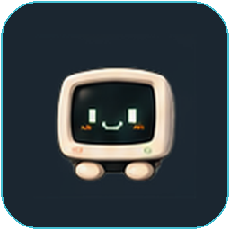
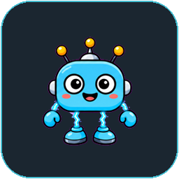

<div align="center">

# Codex Pet Collection

### Original desktop companions for Codex, maintained in one repository.

[简体中文](README.zh-CN.md) · English

<p align="center">
  <a href="pets/crt-monitor/README.md"></a>
  &nbsp;&nbsp;&nbsp;&nbsp;
  <a href="pets/ai-pulse/README.md"></a>
</p>
<p align="center"><strong>CRT Monitor</strong> · <strong>AI Pulse</strong></p>

**Codex Pet v2** · **Multi-pet ready** · **macOS / Windows / Linux**

</div>

This repository is the shared home for original Codex pets, their runtime
packages, source artwork, previews, audits, and maintenance tools. Every pet is
self-contained under `pets/<pet-id>/` and registered in `catalog.json`.

## Pets

| Pet | Status | Preview |
| --- | --- | --- |
| [CRT Monitor](pets/crt-monitor/README.md) | Stable · 88 audited frames | [8×11 contact sheet](pets/crt-monitor/assets/preview-grid.png) |
| [AI Pulse](pets/ai-pulse/README.md) | Stable · 88 audited frames | [8×11 contact sheet](pets/ai-pulse/assets/preview-grid.png) |

## Install

List available pet ids in [catalog.json](catalog.json), then install one:

```bash
./scripts/install.sh <pet-id>
```

On Windows PowerShell:

```powershell
./scripts/install.ps1 -PetId <pet-id>
```

Restart Codex, then choose the pet in **Settings → Appearance → Pets**.
Omitting the id still installs CRT Monitor for backward compatibility.

## Validate

```bash
python3 scripts/validate.py --all
```

Generate a selected pet's native-resolution contact sheet and frame audit:

```bash
python3 scripts/generate-preview-and-audit.py crt-monitor
```

Each pet also preserves confirmed original inputs and a lossless RGBA editing
master under `pets/<pet-id>/assets/source/`. README cards and generated previews
are presentation assets and must not be used as future editing sources.

See [the repository architecture](docs/ARCHITECTURE.md) before adding a pet.

## Compatibility

The original root `pet/` runtime and selected root `assets/` files remain as
byte-identical CRT Monitor compatibility mirrors. External links—including the
existing Awesome Codex Pet listing—therefore keep working. New pets use only
the canonical `pets/<pet-id>/` layout.

## License

Code and scripts are licensed under the [MIT License](LICENSE). Each pet carries
its own artwork license; see the license file inside each pet directory.

---

<div align="center">
<sub>This is an independent community project and is not affiliated with or endorsed by OpenAI.</sub>
</div>
