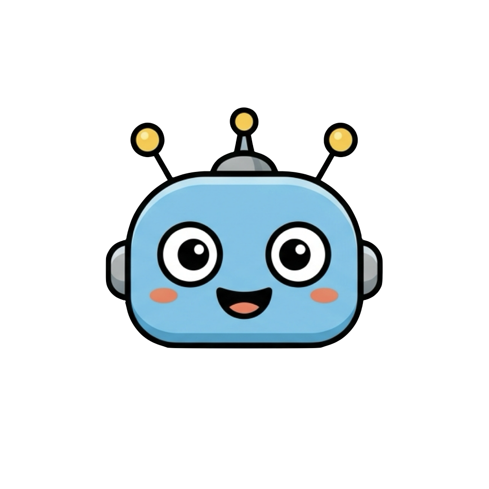

# AI Pulse

AI Pulse is a lively cyan Codex companion derived from the original AI Pulse
logo. Its hands and feet float independently and connect to the head through
electric pulses rather than solid limbs.



## Runtime

- Codex Pet v2
- `1536×2288` transparent WebP atlas
- `8×11` grid with `192×208` cells
- 88 animated frames
- Idle, sleep, exaggerated running, waving, jumping, handstand, fatigue,
  lying down, drinking, listening to music, working, reviewing, and 16 look directions

Install from the repository root:

```bash
./scripts/install.sh ai-pulse
```

The [contact sheet](assets/preview-grid.png) and
[frame audit](assets/frame-audit.md) are generated at native resolution.
The [runtime checksum](assets/spritesheet.sha256) pins the exact atlas.
Artwork is currently distributed under the terms in [LICENSE-ARTWORK](LICENSE-ARTWORK).
